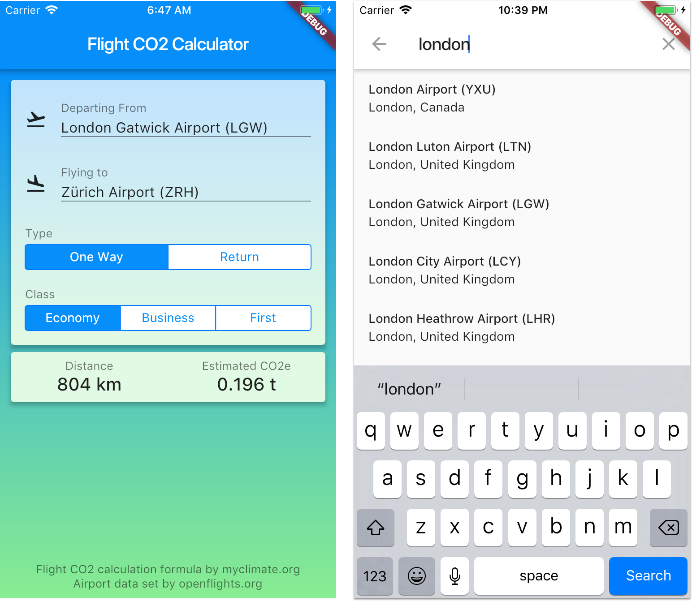

# Flight CO2 Calculator 

## About

This plugin provides a collection of classes that can be used to:

- Load a list of airports from the [OpenFlights.org dataset](https://openflights.org/data.html).
- Lookup airports matching a search query against the entire data-set of airports. 
- Calculate the distance and CO2 emissions from flights.

## What you can do with this

Build a Flight CO2 Calculator app such as this:



## How to use it

Load data:

```dart
List<Airport> airports = await AirportDataReader.load('data/airports.dat');
```

Create an `AirportLookup` service:

```dart
final airportLookup = AirportLookup(airports: airports);
```

Search for airports matching a query:

```dart
List<Airport> results = airportLookup.searchString(query);
```

Calculate distance and CO2 emissions:

```dart
class FlightCalculationData {
  FlightCalculationData({this.distanceKm, this.co2e});
  final double distanceKm;
  final double co2e;
}

FlightCalculationData _calculate(FlightDetails flightDetails) {
  double distanceKm;
  double co2e;
  Airport departure = flightDetails.departure;
  Airport arrival = flightDetails.arrival;
  if (departure != null && arrival != null) {
    double multiplier =
        flightDetails.flightType == FlightType.oneWay ? 1.0 : 2.0;
    distanceKm = DistanceCalculator.distanceInKmBetween(
        departure.location, arrival.location);
    distanceKm = CO2Calculator.correctedDistanceKm(distanceKm);
    co2e =
        CO2Calculator.calculateCO2e(distanceKm, flightDetails.flightClass) *
            multiplier;
  }
  return FlightCalculationData(distanceKm: distanceKm, co2e: co2e);
}
```

## Example

See the sample Flight CO2 Calculator app bundled with the project in the `example` folder.

### [License: MIT](License.md)